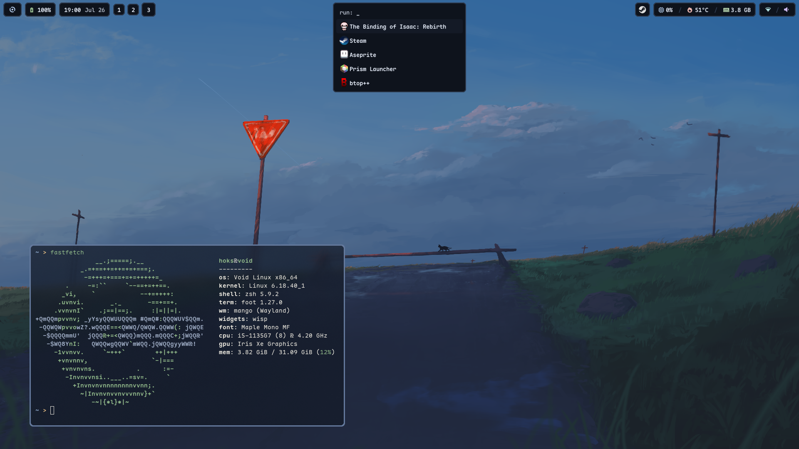

# wisp 

**W**idget **I**nterface, **S**ingle **P**rocess - one Wayland daemon that draws
a whole desktop shell, from a file you write.



A normal Wayland desktop runs a bar, a notification daemon, a locker, a gamma
tool and a wallpaper setter: five daemons, five config formats, five sets of
dependencies. wisp is one process that does all of it - because a bar, a hover
panel, a notification slab, an app menu and a lock screen are the same thing, a
layer-shell surface, configured differently.

And you configure it in its own language. Not a theme file, not a plugin API: a
`.wisp` file that the bundled compiler `wispc` lowers to C and links into the
daemon. Writing `tags()` links the workspace client. Declaring an `osd` surface
links the D-Bus client. A config that mentions neither produces a binary
containing neither - you don't disable features, you never build them.

**0 CPU ticks idle · 3.1 MB RSS · 250 KB binary · links libc and libm, nothing
else.** Wayland and D-Bus are spoken as raw wire.

## The language

```wisp
source bat_s = bat("BAT0");

widget bat {
    icon = bat_s.charging  ? 0xf0084
         : bat_s.pct >= 50 ? 0xf241
         :                   0xf244;
    text = "{bat_s.pct}%";
    fg   = bat_s.pct < 15 ? RED
         : bat_s.pct < 25 ? ORANGE : TEXT;
}
```

That is the whole battery block: a source, a widget, and expressions over the
source. No polling loop, no format string mini-language, no shell script piping
`acpi` into a JSON blob. When `bat_s.pct` changes, wisp recomputes exactly the
widgets whose expressions read it and repaints exactly the damaged rectangle. The
rest of the frame is not touched, and when nothing changes no timer fires at all.

Surfaces are declared the same way, so `radius`, `anchor`, animations and
visibility conditions are all just fields - see the
[docs site](https://darealhoks.github.io/wisp/) for the complete language.

## Install

> [!WARNING]
> This is experimental software. I have daily driven wisp for a few months and
> the sharp edges I hit are gone, but you will find ones I didn't.

```sh
curl -fsSL https://raw.githubusercontent.com/darealhoks/wisp/main/install.sh | sh
wispctl rebuild riverie  # compile an example config, install, run
wisp                     # or: autostart = wisp

# from a checkout instead:
make install             # → ~/.local/bin (override with PREFIX=)
```

Then drive it: `wispctl apps`, `wispctl volume up`, `wispctl notify 1 hi`.

The lock screen needs `libpam` and its headers - I did not rewrite PAM from
scratch, for the obvious security reason. The daemon never links it; only the
separate `wisp-lock` binary does.

## Docs

Everything is at **[darealhoks.github.io/wisp](https://darealhoks.github.io/wisp/)** -
install, a first-config tutorial, the complete language reference, and a
template library.

## Compositor support

wisp needs `wlr-layer-shell-unstable-v1` to run. Every other feature lights up
only if your compositor speaks the relevant protocol, and stays dark without
breaking the rest.

<details>
<summary>Per-compositor table</summary>

| Compositor | Bar (layer-shell) | Workspaces | Gamma | Toplevels | Lock | Fractional scale |
|---|---|---|---|---|---|---|
| **mango** (home) | ✓ | ✓ IPC + ext-ws | ✓ | ✓ | ✓ | ✓ |
| **sway** ≥1.12 | ✓ | ✓ ext-ws | ✓ | ✓ | ✓ | ✓ |
| **niri** ≥25.08 | ✓ | ✓ ext-ws | ✓ | ✓ | ✓ | ✓ |
| **labwc** ≥0.8.3 | ✓ | ✓ ext-ws | ⚠ flaky¹ | ✓ | ✓ | ✓ |
| **hyprland** | ✓ | ✓ own IPC | ✓ | ✓ | ✓ | ✓ |
| **wayfire** | ✓ | ✗ own IPC only² | ✓ | ✓ | ✓ | ✓ |
| **river** | ✓ | ✓ river-status | ✓ | ✓ | ✓ | ✓ |
| **dwl** | ✓ | ✗ patch³ | ✓ | ✗ patch³ | ✓ | ✓ |
| **COSMIC** | ✓ | ✓ ext-ws | ✗⁴ | ? | ✓ | ✓ |
| **KWin** (Plasma ≥6.6) | ✓ | ✓ ext-ws | ✗⁵ | ✗⁵ | ✓ | ✓ |
| **GNOME** (Mutter) | ✗ - unsupported⁶ | - | - | - | - | - |

¹ works but flaky on multi-output; test on your hardware.
² tags exist but only over its own IPC, which wisp doesn't speak.
³ apply `ext-workspace` / `foreign-toplevel` from [dwl-patches](https://codeberg.org/dwl/dwl-patches).
⁴ open feature request, unimplemented.
⁵ KWin declines these for its own KDE protocols.
⁶ Mutter refuses `wlr-layer-shell` by policy.

Checked against newest releases, July 2026; support moves, so check your version.

</details>

## License

MIT - see [LICENSE](LICENSE). Third-party notices (stb_image, libschrift,
gemoji) are in [THIRD_PARTY.md](THIRD_PARTY.md).

---

Numbers above measured with [configs/riverie.wisp](configs/riverie.wisp) on an i5-1135G7 at
1080p: 1 CPU tick per 10 s with its 2-second cpu/mem/temp polls, a flat 0
without them; 3.1 MB RSS, 950 KB PSS. Your numbers depend on what you declared.

This tool was written with the assistance of AI (Claude Opus and Fable).
